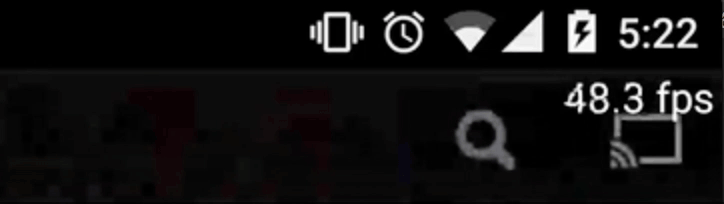

[](https://android-arsenal.com/details/1/2468)
[](https://www.apache.org/licenses/LICENSE-2.0)
[  ](https://bintray.com/wasabeef/maven/takt/_latestVersion)

`Takt` is `Android` library for measuring the `FPS` using [`Choreographer`](http://developer.android.com/intl/ja/reference/android/view/Choreographer.html).  


Screenshot
---



How do I use it?
---

### Setup

##### Dependencies
```groovy
dependencies {
    compile 'jp.wasabeef:takt:1.0.2'
}
```


### Functions

There is a simple initialization step which occurs in your Application class:  
**Simple**
```java
public class MyApplication extends Application {
  public void onCreate() {
    super.onCreate();
    Takt.stock(this).play();
  }

  @Override public void onTerminate() {
    Takt.finish();
    super.onTerminate();
  }
}
```

**Options**

- `seat(Seat seat)` is a position
- `interval(int ms)` is a interval
- `color(int color)` is a text color.
- `size(int size)` is a text size
- `alpha(float alpha)` is a text alpha
- `listener(Audience audience)` is a Listener

```java
Takt.stock(this)
    .seat(Seat.BOTTOM_RIGHT)
    .interval(250)
    .color(Color.WHITE)
    .size(14f)
    .alpha(.5f)
    .listener(new Audience() {
      @Override public void heartbeat(double fps) {
        Log.d("Excellent!", fps + " fps");

        // Logcat
        // jp.wasabeef.example.takt D/Excellent!﹕ 59.28853754940712 fps
        // jp.wasabeef.example.takt D/Excellent!﹕ 59.523809523809526 fps
        // jp.wasabeef.example.takt D/Excellent!﹕ 59.05511811023622 fps
        // jp.wasabeef.example.takt D/Excellent!﹕ 55.33596837944664 fps
        // jp.wasabeef.example.takt D/Excellent!﹕ 59.523809523809526 fps
      }
    })
    .play();
}
```

**Position**

```java
Takt.stock(this)
    .seat(Seat.RIGHT_CENTER)
    .play();

    /**
     * TOP_RIGHT,
     * TOP_LEFT,
     * TOP_CENTER,
     *
     * CENTER,
     * RIGHT_CENTER,
     * LEFT_CENTER,
     *
     * BOTTOM_RIGHT,
     * BOTTOM_LEFT,
     * BOTTOM_CENTER
     */

```

**Hide fps label**

```java
Takt.stock(this)
    .hide()
    .listener(new Audience() {
      @Override public void heartbeat(double fps) {
        Log.d("Excellent!", fps + " fps");
      }
    })
    .play();
```

Requirements
--------------
Android 4.1+ (using the [`Choreographer`](http://developer.android.com/intl/ja/reference/android/view/Choreographer.html))

Developed By
-------
Daichi Furiya (Wasabeef) - <dadadada.chop@gmail.com>

<a href="https://twitter.com/wasabeef_jp">

</a>

License
-------

    Copyright 2015 Wasabeef

    Licensed under the Apache License, Version 2.0 (the "License");
    you may not use this file except in compliance with the License.
    You may obtain a copy of the License at

       http://www.apache.org/licenses/LICENSE-2.0

    Unless required by applicable law or agreed to in writing, software
    distributed under the License is distributed on an "AS IS" BASIS,
    WITHOUT WARRANTIES OR CONDITIONS OF ANY KIND, either express or implied.
    See the License for the specific language governing permissions and
    limitations under the License.
